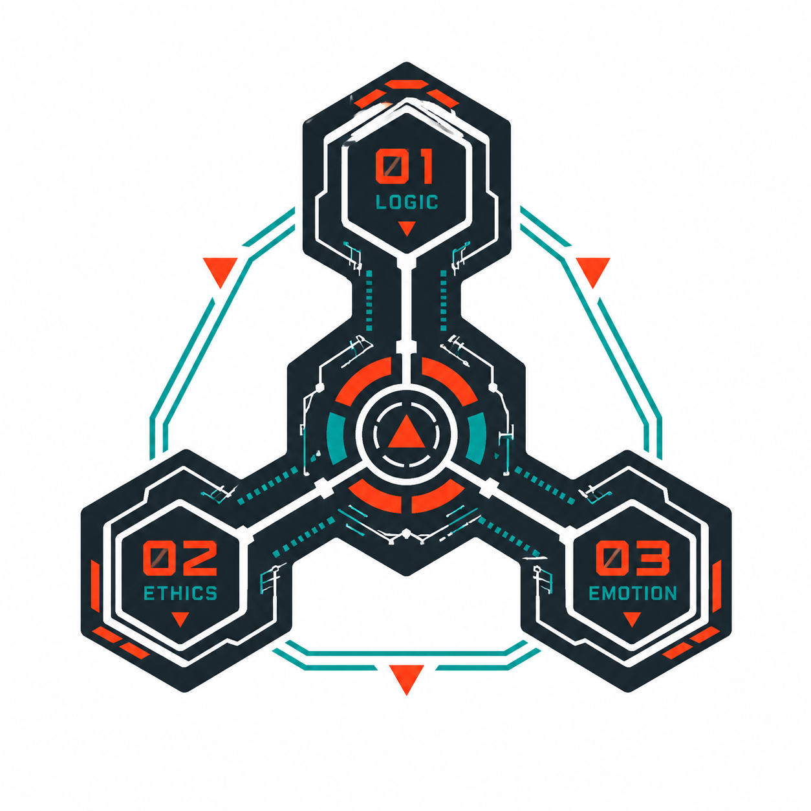

<div align="center">
  

  <h1>MAGI SYSTEM</h1>

  <h3>Redis-backed cross-agent messaging for CLI AI agents</h3>

  <p><strong>Durable team messaging for Codex, Claude Code, and other CLI agents</strong></p>
  <p>Coordinate agents through Redis Streams,<br/>
  Pub/Sub wakeups, team invites, and session-scoped inboxes.</p>
</div>

---

magi is a Rust CLI that stores team membership, invites, message history, and
per-agent inbox cursors in Redis. Redis Streams are the durable message log and
Pub/Sub is used as a low-latency wakeup for `watch`.

## Install

```bash
./install.sh
```

The installer builds the Rust binary and places it at:

- `~/.agents/skills/magi/bin/magi`
- `~/.local/bin/magi`

Configuration and managed Redis state are stored under `~/.magi`.

The installer then registers or updates the magi plugins (best effort) with
whichever agent CLIs are present — `claude` and `codex` — and `./uninstall.sh`
removes them again. See [Plugins](#plugins) below. Override the source
repository or marketplace name with the `MAGI_PLUGIN_REPO` and
`MAGI_PLUGIN_MARKETPLACE` environment variables.

## Plugins

The repository ships two plugins under the `magi` marketplace:

- **`magi` (Codex)** — manifest at `.codex-plugin/plugin.json`, mirrored into
  `plugins/magi/.codex-plugin/` for marketplace installation, exposing the
  `magi` messaging skill plus Codex session hooks that spawn a session-scoped
  `codex` agent, inject magi-system context on each prompt, self-heal a missing
  session record when SessionStart did not fire, and clean the agent up on
  session end.
- **`magi-agent` (Claude Code)** — the event-driven bridge under
  `integrations/magi-agent-plugin/` that turns incoming magi messages into a
  live Claude session.

`./install.sh` installs or updates both by registering the current checkout as
the marketplace:

```bash
# Claude Code
claude plugin marketplace remove magi
claude plugin marketplace add /absolute/path/to/magi
claude plugin marketplace update magi
claude plugin list --json  # installer uses this to choose update vs install
claude plugin update magi-agent@magi  # when already installed
claude plugin install magi-agent@magi # when not yet installed

# Codex
codex plugin marketplace remove magi
codex plugin marketplace add /absolute/path/to/magi
codex plugin marketplace upgrade magi
codex plugin add magi@magi
```

Set `MAGI_PLUGIN_REPO=kent8192/magi` when you explicitly want to install from
GitHub instead of the local checkout. After installing into Claude Code, restart
it and run `/magi-system setup`.

## Quick Start

```bash
~/.local/bin/magi redis start
~/.local/bin/magi team create core
~/.local/bin/magi config set identity.active_team core
~/.local/bin/magi agent spawn --team core --type codex
~/.local/bin/magi invite create --team core
```

On another agent:

```bash
~/.local/bin/magi config set redis.url <redis-url>
~/.local/bin/magi join --invite <token>
~/.local/bin/magi config set identity.active_team core
~/.local/bin/magi agent spawn --team core --type codex
~/.local/bin/magi send <agent-name> "hello"
```

## Commands

```bash
magi                          # interactive mode
magi redis start|status|stop|reset
magi team create <team>
magi team list
magi team members [--team <team>]
magi invite create --team <team> [--ttl 24h]
magi invite list --team <team>
magi invite revoke <invite_id>
magi join --invite <token>
magi agent name
magi agent spawn [--team <team>] [--type <type>]
magi agent despawn [--team <team>] [--name <agent>]
magi send <agent> <message>
magi inbox
magi history [--team <team>] [--agent <agent>]
magi watch [--format line|json]
magi ssh start|status|stop
magi config get <key>
magi config set <key> <value>
```

Inside a runtime session, `send`, `inbox`, `history`, and `watch` require the
session record keyed by the runtime session id for the agent name, while the
team comes from that record or `identity.active_team`. Persistent config never
stores an active agent, so concurrent Codex or Claude Code sessions in the same
`$HOME` cannot overwrite each other's MAGI agent names.

## Redis

`magi redis start` prefers Docker and falls back to `redis-server` when Docker
is unavailable. Redis auth is generated and written into `~/.magi/config.toml`;
passwords are not passed on the command line.

## Legacy Scripts

The old Bash/SQLite scripts are retired. They now exit with a clear retirement
notice and point callers to the Rust CLI.

## Acknowledgments

MAGI SYSTEM builds on [agmsg](https://github.com/fujibee/agmsg), the original
Bash + SQLite cross-agent messaging tool. Thanks to its authors for the design
this project is based on.
